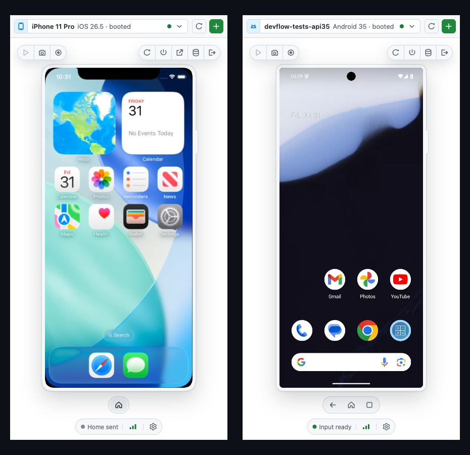
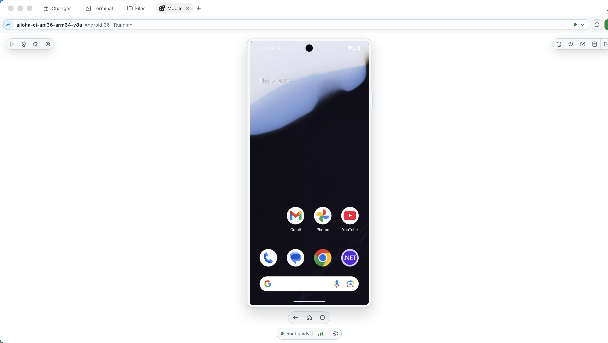
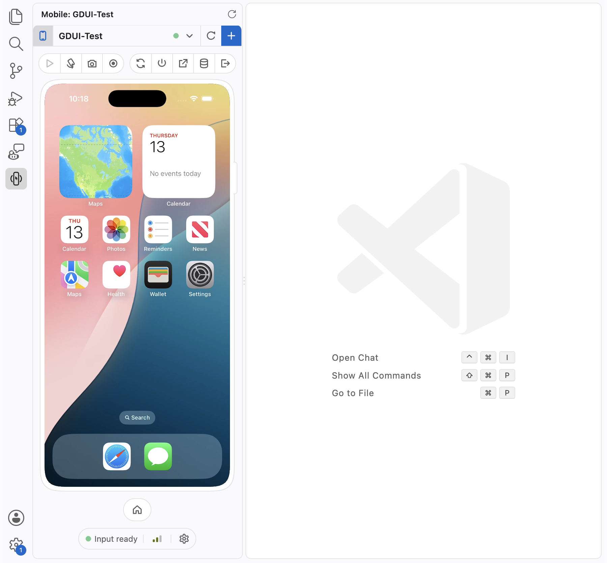
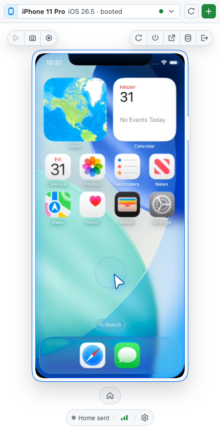
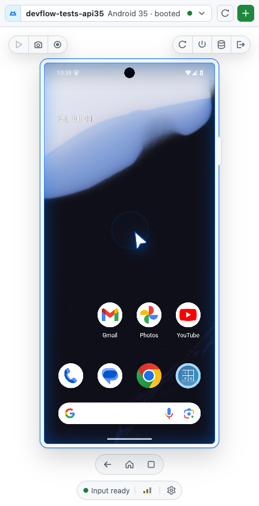

# Mobile Canvas

<p align="center">
  <a href="#github-copilot-app"></a>
  <a href="https://marketplace.visualstudio.com/items?itemName=redth.mobile-canvas"></a>
  <a href="https://marketplace.visualstudio.com/items?itemName=redth.mobile-canvas"></a>
  <a href="https://github.com/Redth/mobile-canvas-ghcp/actions/workflows/ci.yml"></a>
  <a href="LICENSE"></a>
</p>

View, create, boot, and **interact with** local iOS Simulators and Android
emulators without leaving GitHub Copilot or VS Code. Mobile Canvas gives your
agent the same controls through MCP, so it can deploy, navigate, inspect, and
capture evidence on the device you are watching.

<p align="center">
  
</p>

Live H.264 video at ~58 FPS on iOS and ~50 FPS on Android, with real tap, drag,
scroll, and keyboard input. Everything runs locally on loopback; nothing is
uploaded anywhere.

## Install

### GitHub Copilot app

Add this repository as a Copilot plugin marketplace, install **mobile-canvas**,
then open the **Mobile Device** canvas:

```text
/plugin marketplace add Redth/mobile-canvas-ghcp
/plugin install mobile-canvas@mobile-canvas-ghcp
```

Reload Copilot after installation. The plugin registers the canvas and all
`mobile_device_*` tools together; there is no separate executable download.

<p align="center">
  
</p>

### VS Code

<p>
  <a href="https://marketplace.visualstudio.com/items?itemName=redth.mobile-canvas"></a>
</p>

Install **Mobile Canvas** from the
[Visual Studio Marketplace](https://marketplace.visualstudio.com/items?itemName=redth.mobile-canvas),
reload VS Code, and open **Mobile** from the Activity Bar. The Marketplace
automatically selects the package matching your platform.

<p align="center">
  
</p>

The extension includes the native runtimes and registers the
`mobile_device_*` tools with Copilot Chat automatically. No global tool or
`mcp.json` is required. See the [VS Code guide](docs/vscode.md) for remote
workspace behavior, manual MCP setup, and development commands.

Both hosts still require Xcode for iOS or the Android SDK for Android; see
[Requirements](#requirements).

## Give Copilot hands and eyes

Mobile Canvas lets an agent work on the same device you see. Ask Copilot to
reproduce a bug, navigate a flow, capture evidence, or inspect accessibility
without switching tools or wiring up a separate MCP server.

```text
Boot an iPhone simulator, install my app, and walk through sign in.
Find the Settings button on the Android emulator and tap it.
Take a screenshot of the current screen and describe any layout issues.
```

Agent actions automatically select the target device. An animated cursor and
accent glow make every automated interaction visible, so you can follow along
and take over at any time.

<table>
  <tr>
    <td width="50%"></td>
    <td width="50%"></td>
  </tr>
</table>

## What it does

**Device management**

- Discover installed runtimes/system images, device types, and existing devices.
- Create and automatically boot devices headlessly, then restart, shut down, show their native
  window, erase, or delete them. Showing an Android emulator restarts it with its window enabled.
- Erase and delete always require an explicit confirmation.

**Live interaction**

- Live Annex-B H.264 decoded with WebCodecs, with automatic PNG polling
  whenever the stream is unavailable.
- Tap, long press, drag, swipe, wheel scroll, text, keys, and device buttons,
  mapped correctly at every view scale and orientation.
- PNG screenshots and bounded video recordings written to disk.

**Agent control**

- 24 MCP tools mirroring the 24 canvas actions one-to-one.
- Every target-changing call returns the full device record, including the
  `udid`/serial you need to hand to a deploy command.
- When an agent drives the device, the canvas shows an accent-coloured glow and
  an animated cursor so a human watching can tell automation from their own
  input.

## Requirements

| | Requirement |
|---|---|
| **iOS** | macOS and a full Xcode installation with Simulator runtimes |
| **Android** | Android SDK with `emulator`, `avdmanager`, and `adb` on `PATH` |
| **Optional iOS fallbacks** | [`idb`](https://fbidb.io) (provides `idb_companion`), plus Screen Recording and Accessibility permission for ScreenCaptureKit window capture |

The bundled `mobile-screencap` helper provides iOS touch, keyboard, buttons,
rotation, accessibility hierarchy, and direct video capture. Xcode 26 uses
Simulator.app; Xcode 27 uses Device Hub. Neither visible app needs to be open
for headless input or hierarchy reads.

Meta's `idb` metapackage is not required for `ui_tree`, `ui_find`, or `ui_tap`.
It remains an optional compatibility input fallback and the final live-video
fallback if the bundled native paths cannot start. Mobile Canvas only reports
its absence when an operation actually needs it. To install it, current
Homebrew versions require explicitly trusting the third-party tap:

```bash
brew tap facebook/fb
brew trust facebook/fb
brew install facebook/fb/idb
```

Then add the installed executable to your shell environment. For zsh:

```bash
echo "export IDB_COMPANION_PATH=\"$(brew --prefix idb-companion)/bin/idb_companion\"" >> ~/.zshrc
source ~/.zshrc
```

Confirm that the configured path points to the executable:

```bash
test -x "$IDB_COMPANION_PATH" && "$IDB_COMPANION_PATH" --version
```

Android emulators must be started with `-gpu host`. A software-rendered AVD
drops video from ~50 FPS to ~3 FPS.

| Platform | iOS Simulator | Android emulator | Video |
|---|---|---|---|
| macOS | yes | yes | H.264 |
| Windows | no | yes | screenshot polling |
| Linux | no | yes | screenshot polling |

iOS control requires Xcode's `simctl` and the bundled CoreSimulator helper, so it
is macOS-only. Android works everywhere; hardware H.264 encoding currently runs
through the same macOS helper, so elsewhere the canvas falls back to screenshot
polling.

## CLI and source installs

### From source

```bash
git clone https://github.com/Redth/mobile-canvas-ghcp
cd mobile-canvas-ghcp
./scripts/build.sh      # Native AOT binary + universal Swift capture helper
./scripts/install.sh    # Installs into ~/.copilot/extensions/mobile-canvas
```

Reload Copilot afterwards so it picks up the extension. Source installs register
as **Mobile Device (Local)** (`mobile-device-local`), so a development build can
coexist with the marketplace plugin without registering the same canvas ID twice.

### As a .NET global tool

For a plain CLI/MCP install without the canvas:

```bash
dotnet tool install -g MobileCanvas.Tool
```

## Usage

Ask Copilot to open the **Mobile Device** canvas, or open it from the canvas
picker. Select a running device, or create one from an installed runtime.

From the CLI:

```bash
mobile-canvas devices list --json
mobile-canvas devices boot <id> --wait
mobile-canvas input tap <id> --x 100 --y 200
mobile-canvas screenshot <id> --output shot.png
mobile-canvas host status
mobile-canvas guide
```

Every query command accepts `--json` and `--schema`, so output composes safely
with `jq`.

## Agent tools

All 24 tools are available both as canvas actions and as MCP tools named
`mobile_device_*`:

| Group | Tools |
|---|---|
| Discovery | `list`, `get`, `catalog`, `select`, `get_selected`, `display` |
| Lifecycle | `create`, `boot`, `shutdown`, `restart`, `reveal`, `erase`, `delete` |
| Input | `tap`, `long_press`, `swipe`, `type_text`, `press_key`, `press_button`, `rotate` |
| Media | `screenshot`, `recording_start`, `recording_stop`, `recording_status` |

A typical agent flow is `list` → `select` → read `udid` from the result → deploy
your app to that exact device → drive it with the input tools.

## VS Code integration

The Marketplace installs a self-contained package on supported desktop targets;
the universal fallback downloads and verifies its pinned runtime on first use.
Agent actions select and animate the same device in the live Activity Bar view.
The view follows the active VS Code theme while preserving the GitHub canvas
appearance elsewhere. Attach the selected device, a fresh screenshot, or its
accessibility tree to chat with `#mobileDevice`, `#mobileScreenshot`, or
`#mobileUiTree`.

The extension runs locally for Remote SSH, Dev Containers, and Codespaces.
`vscode.dev` is unsupported.

## Architecture

```text
GitHub Copilot app        VS Code extension          CLI / other agent
  └─ extension.mjs          ├─ Activity Bar webview    └─ mobile-canvas mcp
       │ canvas actions     └─ MCP context proxy              │
       └──────────────────┬───────────────┬────────────────────┘
                          ▼
                  mobile-canvas host     (per-user, per-protocol singleton)
                    ├─ HTTP + WebSocket UI transport
                    ├─ per-panel selected-device state
                    └─ platform backends
                         ├─ iOS      simctl + bundled CoreSimulator helper + optional idb
                         └─ Android  emulator gRPC + adb
```

The host is started on demand, binds only to `127.0.0.1`, and authenticates
canvas panels with a scoped reload grant exchanged for a rotating session cookie.
The grant remains in the URL fragment so a host-restored renderer can reconnect
without exposing the credential in an HTTP request.
It exits after an idle grace period and **never** shuts down a device
implicitly, so detaching a panel is always safe.

GitHub Copilot and VS Code releases using the same host protocol share the newest
compatible host. Hosts are isolated under `~/.mobile-canvas/hosts/v<protocol>/`,
so an older installation using the legacy location and future incompatible
protocol versions can run at the same time without replacing each other's
process. A release that makes a backwards-incompatible host API change must bump
`MobileCanvasProtocol.Version`; package versions alone do not create extra hosts.

Video is deliberately split from input on both platforms:

| Concern | iOS | Android |
|---|---|---|
| Frames | CoreSimulator IOSurface (ScreenCaptureKit fallback) | emulator gRPC `streamScreenshot` |
| Encode | VideoToolbox H.264 | same VideoToolbox H.264 |
| Input | bundled CoreSimulator HID (Indigo/DTUHID), `GSEvent` rotation; optional idb fallback | emulator gRPC `streamInputEvent` |
| Lifecycle | `simctl` | `emulator`/`avdmanager` + gRPC |

Raw Android frames are encoded before they reach the browser, so only ~1-2 Mbps
crosses to the canvas instead of the 41-577 MiB/s the emulator emits.

## Development

```bash
dotnet build MobileCanvas.slnx
dotnet test  tests/MobileCanvas.Tests/MobileCanvas.Tests.csproj
npm ci --prefix vscode --ignore-scripts
npm test --prefix vscode
npm run package --prefix vscode
./scripts/build.sh          # builds one architecture into .build/bin/<rid>
./scripts/release.sh        # rebuilds macOS release assets for local validation
```

Two things to know before you change anything:

- **Web assets are embedded resources.** Any change to `web/` needs a
  republish, not a file copy. `extension.mjs` is the opposite — it is copied
  directly and is not part of the binary.
- **`dotnet publish` does not build the Swift helper.** `scripts/build.sh`
  builds both. A stale helper fails only later, at stream start; check it with
  `mobile-screencap --help` and confirm `accessibility`, `framebuffer`, `hid`,
  `hid-doctor`, and Android's `encode` subcommands exist.

Changing `src/` or `native/` requires the **Release runtimes** workflow. It builds
each Native AOT RID on its native OS, publishes checksummed release assets, and
packages both host extensions from those exact binaries. See
[How the executable ships](docs/distribution.md).

## License

MIT. See [LICENSE](LICENSE).
